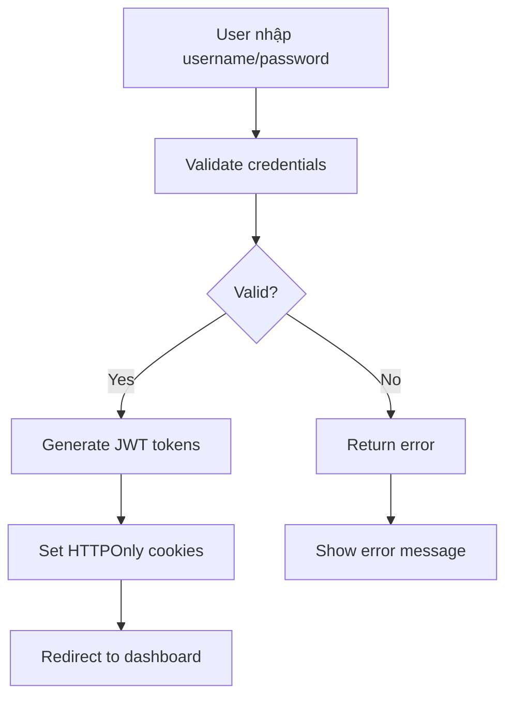
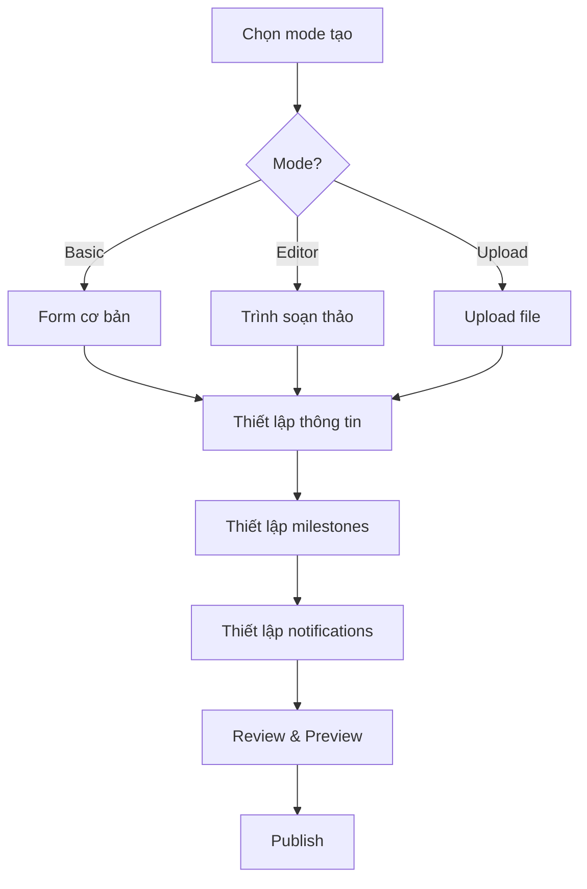
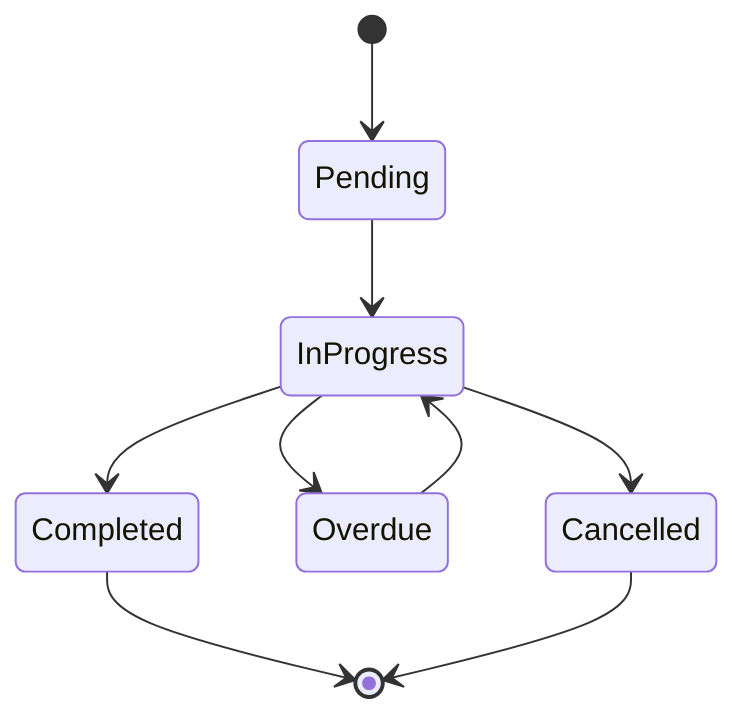
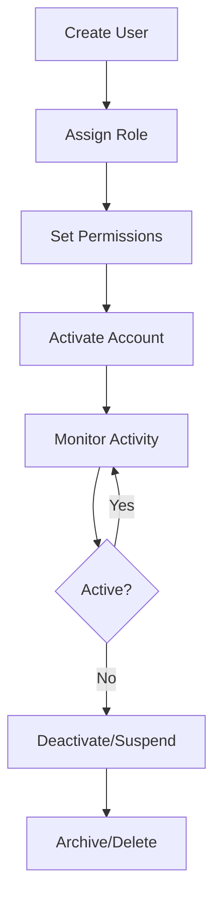
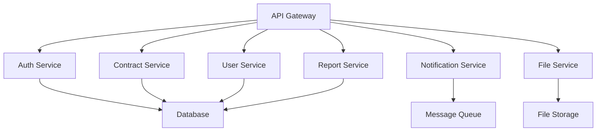
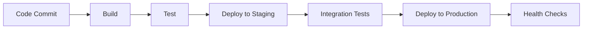

# TÀI LIỆU CHỨC NĂNG NGHIỆP VỤ HỆ THỐNG QUẢN LÝ HỢP ĐỒNG

## 📋 TỔNG QUAN NGHIỆP VỤ

### Mục tiêu nghiệp vụ
Hệ thống quản lý hợp đồng nội bộ được thiết kế để phục vụ quy trình làm việc của 2 phòng ban chính:
- **Phòng Hành chính**: Quản lý hợp đồng nội bộ, nhân sự, tài chính
- **Phòng Kế toán**: Quản lý hợp đồng tài chính, thanh toán, báo cáo

### Vai trò người dùng
1. **Quản lý (Manager)**: Có quyền hạn cao nhất trong phòng ban
2. **Nhân viên (Staff)**: Thực hiện các tác vụ được phân công

---

## 🔐 QUẢN LÝ XÁC THỰC & PHÂN QUYỀN

### 1. Đăng nhập & Phiên làm việc

#### Quy trình đăng nhập


#### Quản lý phiên
- **Session timeout**: 15 phút không hoạt động
- **Auto refresh**: Tự động refresh token trước 5 phút hết hạn
- **Concurrent sessions**: Tối đa 5 phiên đồng thời
- **Force logout**: Quản lý có thể force logout user

#### Bảo mật
- **Password policy**: Tối thiểu 8 ký tự, có chữ hoa, chữ thường, số
- **Failed attempts**: Khóa tài khoản sau 5 lần đăng nhập sai
- **Lockout duration**: 15 phút khóa tài khoản
- **Password expiry**: 90 ngày phải đổi mật khẩu

### 2. Phân quyền chi tiết

#### Role-Based Access Control (RBAC)
```typescript
// Các vai trò hệ thống
enum UserRole {
  ADMIN = 'ADMIN',           // Quản trị viên hệ thống
  MANAGER = 'MANAGER',       // Quản lý phòng ban
  STAFF = 'STAFF',          // Nhân viên
  USER = 'USER'             // Người dùng cơ bản
}

// Các quyền chi tiết
enum Permission {
  // Contract permissions
  CONTRACTS_CREATE = 'contracts_create',
  CONTRACTS_READ = 'contracts_read',
  CONTRACTS_UPDATE = 'contracts_update',
  CONTRACTS_DELETE = 'contracts_delete',
  CONTRACTS_APPROVE = 'contracts_approve',
  CONTRACTS_EXPORT = 'contracts_export',
  
  // User management
  USER_MANAGEMENT = 'user_management',
  ROLE_MANAGEMENT = 'role_management',
  
  // System administration
  SYSTEM_SETTINGS = 'system_settings',
  AUDIT_LOGS = 'audit_logs',
  
  // Reports
  REPORTS_VIEW = 'reports_view',
  REPORTS_EXPORT = 'reports_export'
}
```

#### Matrix phân quyền
| Chức năng | ADMIN | MANAGER | STAFF | USER |
|-----------|-------|---------|-------|------|
| Tạo hợp đồng | ✅ | ✅ | ✅ | ❌ |
| Xem hợp đồng | ✅ | ✅ | ✅ | ✅ (own) |
| Sửa hợp đồng | ✅ | ✅ | ✅ | ❌ |
| Xóa hợp đồng | ✅ | ✅ | ❌ | ❌ |
| Phê duyệt hợp đồng | ✅ | ✅ | ❌ | ❌ |
| Export hợp đồng | ✅ | ✅ | ✅ | ❌ |
| Quản lý user | ✅ | ❌ | ❌ | ❌ |
| Quản lý role | ✅ | ❌ | ❌ | ❌ |
| Cài đặt hệ thống | ✅ | ❌ | ❌ | ❌ |
| Xem audit log | ✅ | ✅ | ❌ | ❌ |

---

## 📄 QUẢN LÝ HỢP ĐỒNG

### 1. Quy trình tạo hợp đồng

#### Workflow tổng thể


#### 3 Phương thức tạo hợp đồng

##### 1.1 Basic Form
- **Mục đích**: Tạo hợp đồng đơn giản với form có sẵn
- **Đối tượng**: Nhân viên mới, hợp đồng đơn giản
- **Tính năng**:
  - Form fields được cấu hình sẵn
  - Validation tự động
  - Template-based generation
  - Quick save & auto-save

##### 1.2 Editor (Tiptap)
- **Mục đích**: Soạn thảo hợp đồng chuyên nghiệp
- **Đối tượng**: Chuyên viên pháp lý, hợp đồng phức tạp
- **Tính năng**:
  - Rich text editor với formatting
  - Template suggestions
  - Legal clause library
  - Version control
  - Collaborative editing
  - Export to PDF/DOCX

##### 1.3 Upload & Edit
- **Mục đích**: Chỉnh sửa hợp đồng có sẵn
- **Đối tượng**: Hợp đồng từ đối tác, template có sẵn
- **Tính năng**:
  - Upload Word/PDF files
  - OCR text extraction
  - Convert to editable format
  - Track changes
  - Merge changes

### 2. Quản lý nội dung hợp đồng

#### Cấu trúc hợp đồng
```typescript
interface ContractContent {
  // Basic information
  contractInfo: {
    name: string;
    contractCode: string;
    type: ContractType;
    category: ContractCategory;
    priority: Priority;
  };
  
  // Parties information
  parties: {
    company: CompanyInfo;
    counterparty: CounterpartyInfo;
    representatives: RepresentativeInfo[];
  };
  
  // Contract terms
  terms: {
    effectiveDate: Date;
    expiryDate: Date;
    value: Money;
    currency: string;
    paymentTerms: PaymentTerms;
    deliverables: Deliverable[];
  };
  
  // Legal clauses
  clauses: LegalClause[];
  
  // Attachments
  attachments: Attachment[];
  
  // Signatures
  signatures: Signature[];
}
```

#### Template System
- **Template Categories**: Service, Purchase, Employment, NDA, Partnership, Rental
- **Template Versioning**: Quản lý phiên bản template
- **Template Approval**: Workflow phê duyệt template mới
- **Template Sharing**: Chia sẻ template giữa các phòng ban

### 3. Quản lý tiến độ (Milestones & Tasks)

#### Milestone Management
```typescript
interface Milestone {
  id: string;
  name: string;
  description: string;
  startDate: Date;
  endDate: Date;
  status: MilestoneStatus;
  priority: Priority;
  assignedTo: User;
  tasks: Task[];
  dependencies: string[]; // Milestone IDs
  completion: number; // 0-100%
}
```

#### Task Management
```typescript
interface Task {
  id: string;
  name: string;
  description: string;
  estimatedHours: number;
  actualHours?: number;
  status: TaskStatus;
  assignedTo: User;
  dueDate: Date;
  completedDate?: Date;
  dependencies: string[]; // Task IDs
  attachments: Attachment[];
  comments: Comment[];
}
```

#### Workflow States


### 4. Collaboration & Sharing

#### Collaborator Roles
- **Owner**: Người tạo hợp đồng, có toàn quyền
- **Editor**: Có thể chỉnh sửa nội dung
- **Reviewer**: Có thể review và comment
- **Viewer**: Chỉ có thể xem

#### Real-time Collaboration
- **Live editing**: Nhiều người cùng chỉnh sửa
- **Conflict resolution**: Xử lý xung đột khi edit
- **Change tracking**: Theo dõi thay đổi
- **Comments**: Hệ thống comment và reply

---

## 🔔 HỆ THỐNG THÔNG BÁO

### 1. Types of Notifications

#### Email Notifications
- **Contract milestones**: Nhắc nhở milestone sắp đến hạn
- **Task assignments**: Thông báo khi được gán task
- **Approval requests**: Yêu cầu phê duyệt
- **System alerts**: Cảnh báo hệ thống

#### Push Notifications
- **Real-time updates**: Cập nhật real-time
- **Urgent alerts**: Cảnh báo khẩn cấp
- **Mobile notifications**: Thông báo trên mobile

#### In-app Notifications
- **Activity feed**: Feed hoạt động
- **Status updates**: Cập nhật trạng thái
- **Collaboration alerts**: Thông báo collaboration

### 2. Notification Rules

#### Rule Configuration
```typescript
interface NotificationRule {
  id: string;
  name: string;
  event: NotificationEvent;
  conditions: NotificationCondition[];
  actions: NotificationAction[];
  enabled: boolean;
  schedule?: NotificationSchedule;
}

enum NotificationEvent {
  CONTRACT_CREATED = 'contract_created',
  MILESTONE_DUE = 'milestone_due',
  TASK_ASSIGNED = 'task_assigned',
  APPROVAL_REQUIRED = 'approval_required',
  CONTRACT_EXPIRING = 'contract_expiring'
}
```

#### Scheduling
- **Working hours**: Chỉ gửi trong giờ làm việc
- **Quiet hours**: Không gửi trong giờ nghỉ
- **Escalation**: Tự động escalate nếu không phản hồi
- **Frequency control**: Kiểm soát tần suất thông báo

### 3. Notification Templates

#### Email Templates
```html
<!-- Milestone Due Template -->
<h2>Milestone Due: {{milestone.name}}</h2>
<p>Contract: {{contract.name}}</p>
<p>Due Date: {{milestone.dueDate}}</p>
<p>Assigned To: {{milestone.assignedTo.name}}</p>
<a href="{{contractUrl}}">View Contract</a>
```

#### Push Templates
```json
{
  "title": "Milestone Due",
  "body": "{{milestone.name}} is due in {{timeRemaining}}",
  "data": {
    "contractId": "{{contract.id}}",
    "milestoneId": "{{milestone.id}}"
  }
}
```

---

## 📊 BÁO CÁO & ANALYTICS

### 1. Contract Reports

#### Summary Reports
- **Total contracts**: Tổng số hợp đồng
- **Active contracts**: Hợp đồng đang hoạt động
- **Expired contracts**: Hợp đồng hết hạn
- **Value by type**: Giá trị theo loại hợp đồng

#### Performance Reports
- **Contract lifecycle**: Thời gian xử lý hợp đồng
- **Approval times**: Thời gian phê duyệt
- **Milestone completion**: Tỷ lệ hoàn thành milestone
- **Task efficiency**: Hiệu quả thực hiện task

#### Financial Reports
- **Contract values**: Tổng giá trị hợp đồng
- **Payment tracking**: Theo dõi thanh toán
- **Revenue forecasting**: Dự báo doanh thu
- **Cost analysis**: Phân tích chi phí

### 2. User Activity Reports

#### Activity Tracking
- **Login patterns**: Mẫu đăng nhập
- **Feature usage**: Sử dụng tính năng
- **Time spent**: Thời gian sử dụng
- **Productivity metrics**: Chỉ số năng suất

#### Performance Metrics
- **Contracts created**: Số hợp đồng tạo
- **Tasks completed**: Số task hoàn thành
- **Response times**: Thời gian phản hồi
- **Quality scores**: Điểm chất lượng

### 3. System Health Reports

#### System Metrics
- **API performance**: Hiệu suất API
- **Database performance**: Hiệu suất database
- **Error rates**: Tỷ lệ lỗi
- **Uptime**: Thời gian hoạt động

#### Security Reports
- **Login attempts**: Lần đăng nhập
- **Failed logins**: Đăng nhập thất bại
- **Permission changes**: Thay đổi quyền
- **Audit events**: Sự kiện audit

---

## 🔍 AUDIT & COMPLIANCE

### 1. Audit Logging

#### Logged Events
```typescript
enum AuditEvent {
  // Authentication events
  USER_LOGIN = 'user_login',
  USER_LOGOUT = 'user_logout',
  PASSWORD_CHANGE = 'password_change',
  
  // Contract events
  CONTRACT_CREATED = 'contract_created',
  CONTRACT_UPDATED = 'contract_updated',
  CONTRACT_DELETED = 'contract_deleted',
  CONTRACT_EXPORTED = 'contract_exported',
  
  // User management events
  USER_CREATED = 'user_created',
  USER_UPDATED = 'user_updated',
  USER_DELETED = 'user_deleted',
  ROLE_ASSIGNED = 'role_assigned',
  
  // System events
  SETTINGS_CHANGED = 'settings_changed',
  BACKUP_CREATED = 'backup_created',
  SYSTEM_MAINTENANCE = 'system_maintenance'
}
```

#### Audit Data
```typescript
interface AuditLog {
  id: string;
  timestamp: Date;
  userId: string;
  userAgent: string;
  ipAddress: string;
  event: AuditEvent;
  resourceType: string;
  resourceId?: string;
  details: object;
  changes?: {
    before: object;
    after: object;
  };
}
```

### 2. Compliance Features

#### Data Retention
- **Contract retention**: Lưu trữ hợp đồng theo quy định
- **Audit retention**: Lưu trữ audit log 7 năm
- **Backup retention**: Lưu trữ backup 3 năm
- **Archive policy**: Chính sách lưu trữ

#### Data Protection
- **Encryption**: Mã hóa dữ liệu nhạy cảm
- **Access control**: Kiểm soát truy cập
- **Data masking**: Ẩn dữ liệu nhạy cảm
- **GDPR compliance**: Tuân thủ GDPR

---

## ⚙️ SYSTEM ADMINISTRATION

### 1. User Management

#### User Lifecycle


#### Bulk Operations
- **Bulk user creation**: Tạo nhiều user cùng lúc
- **Bulk role assignment**: Gán role hàng loạt
- **Bulk deactivation**: Vô hiệu hóa hàng loạt
- **Bulk export**: Xuất dữ liệu user

### 2. System Configuration

#### Notification Settings
```typescript
interface NotificationConfig {
  email: {
    enabled: boolean;
    smtp: SMTPConfig;
    templates: EmailTemplate[];
  };
  push: {
    enabled: boolean;
    vapidKeys: VAPIDKeys;
  };
  sms: {
    enabled: boolean;
    provider: SMSProvider;
    apiKey: string;
  };
  workingHours: {
    start: string; // "08:00"
    end: string;   // "17:00"
    timezone: string;
  };
  quietHours: {
    enabled: boolean;
    start: string; // "22:00"
    end: string;   // "07:00"
  };
}
```

#### Security Settings
```typescript
interface SecurityConfig {
  passwordPolicy: {
    minLength: number;
    requireUppercase: boolean;
    requireLowercase: boolean;
    requireNumbers: boolean;
    requireSpecialChars: boolean;
    maxAge: number; // days
  };
  sessionPolicy: {
    maxConcurrentSessions: number;
    sessionTimeout: number; // minutes
    rememberMeDuration: number; // days
  };
  loginPolicy: {
    maxFailedAttempts: number;
    lockoutDuration: number; // minutes
    requireTwoFactor: boolean;
  };
}
```

### 3. Backup & Recovery

#### Backup Strategy
- **Daily backups**: Backup hàng ngày
- **Weekly backups**: Backup hàng tuần
- **Monthly backups**: Backup hàng tháng
- **Point-in-time recovery**: Khôi phục theo thời điểm

#### Recovery Procedures
- **Data recovery**: Khôi phục dữ liệu
- **System recovery**: Khôi phục hệ thống
- **Disaster recovery**: Khôi phục thảm họa
- **Testing procedures**: Quy trình test

---

## 📱 MOBILE & INTEGRATION

### 1. Mobile Features

#### Mobile App Capabilities
- **Contract viewing**: Xem hợp đồng
- **Task management**: Quản lý task
- **Notifications**: Nhận thông báo
- **Quick approvals**: Phê duyệt nhanh
- **Offline support**: Hỗ trợ offline

#### Responsive Web Design
- **Mobile-first**: Thiết kế mobile-first
- **Touch-friendly**: Thân thiện với touch
- **Progressive Web App**: PWA features
- **Cross-platform**: Đa nền tảng

### 2. Third-party Integrations

#### Email Integration
- **SMTP integration**: Tích hợp SMTP
- **Email parsing**: Parse email
- **Email templates**: Template email
- **Email tracking**: Theo dõi email

#### Document Integration
- **Google Docs**: Tích hợp Google Docs
- **Microsoft Office**: Tích hợp Office
- **PDF processing**: Xử lý PDF
- **OCR integration**: Tích hợp OCR

#### Calendar Integration
- **Google Calendar**: Tích hợp Google Calendar
- **Outlook Calendar**: Tích hợp Outlook
- **Event scheduling**: Lập lịch sự kiện
- **Reminder sync**: Đồng bộ nhắc nhở

---

## 🔧 TECHNICAL IMPLEMENTATION

### 1. Architecture Patterns

#### Microservices Architecture


#### Event-Driven Architecture
- **Event sourcing**: Lưu trữ events
- **CQRS**: Command Query Responsibility Segregation
- **Message queues**: Hàng đợi tin nhắn
- **Event streaming**: Streaming events

### 2. Performance Optimization

#### Caching Strategy
```typescript
interface CacheConfig {
  redis: {
    host: string;
    port: number;
    password: string;
    db: number;
  };
  cacheKeys: {
    userPermissions: string;
    contractTemplates: string;
    systemSettings: string;
    auditLogs: string;
  };
  ttl: {
    short: number;   // 5 minutes
    medium: number;  // 1 hour
    long: number;    // 24 hours
  };
}
```

#### Database Optimization
- **Indexing strategy**: Chiến lược indexing
- **Query optimization**: Tối ưu query
- **Connection pooling**: Pool kết nối
- **Read replicas**: Replica đọc

### 3. Security Implementation

#### Authentication Flow
```typescript
interface AuthFlow {
  login: {
    validateCredentials: (username: string, password: string) => Promise<boolean>;
    generateTokens: (user: User) => Promise<{accessToken: string, refreshToken: string}>;
    setCookies: (tokens: Tokens) => void;
  };
  refresh: {
    validateRefreshToken: (token: string) => Promise<boolean>;
    generateNewTokens: (user: User) => Promise<Tokens>;
  };
  logout: {
    invalidateTokens: (userId: string) => Promise<void>;
    clearCookies: () => void;
  };
}
```

#### Authorization Implementation
```typescript
interface Authorization {
  checkPermission: (user: User, resource: string, action: string) => boolean;
  checkRole: (user: User, role: string) => boolean;
  getEffectivePermissions: (user: User) => Permission[];
  validateResourceAccess: (user: User, resourceId: string) => boolean;
}
```

---

## 📈 MONITORING & ALERTING

### 1. System Monitoring

#### Performance Metrics
- **Response times**: Thời gian phản hồi
- **Throughput**: Thông lượng
- **Error rates**: Tỷ lệ lỗi
- **Resource usage**: Sử dụng tài nguyên

#### Health Checks
- **API health**: Sức khỏe API
- **Database health**: Sức khỏe database
- **External services**: Dịch vụ bên ngoài
- **File storage**: Lưu trữ file

### 2. Business Metrics

#### Contract Metrics
- **Creation rate**: Tỷ lệ tạo hợp đồng
- **Completion rate**: Tỷ lệ hoàn thành
- **Approval time**: Thời gian phê duyệt
- **Value tracking**: Theo dõi giá trị

#### User Metrics
- **Active users**: Người dùng hoạt động
- **Feature usage**: Sử dụng tính năng
- **User satisfaction**: Sự hài lòng
- **Support tickets**: Ticket hỗ trợ

### 3. Alerting System

#### Alert Types
- **Critical alerts**: Cảnh báo nghiêm trọng
- **Warning alerts**: Cảnh báo cảnh báo
- **Info alerts**: Thông tin
- **Success alerts**: Thành công

#### Alert Channels
- **Email alerts**: Cảnh báo email
- **SMS alerts**: Cảnh báo SMS
- **Slack alerts**: Cảnh báo Slack
- **Webhook alerts**: Cảnh báo webhook

---

## 🚀 DEPLOYMENT & SCALABILITY

### 1. Deployment Strategy

#### Environment Setup
- **Development**: Môi trường phát triển
- **Staging**: Môi trường staging
- **Production**: Môi trường production
- **Testing**: Môi trường testing

#### CI/CD Pipeline


### 2. Scalability Considerations

#### Horizontal Scaling
- **Load balancing**: Cân bằng tải
- **Auto scaling**: Tự động scale
- **Database sharding**: Sharding database
- **CDN integration**: Tích hợp CDN

#### Vertical Scaling
- **Resource optimization**: Tối ưu tài nguyên
- **Memory management**: Quản lý bộ nhớ
- **CPU optimization**: Tối ưu CPU
- **Storage optimization**: Tối ưu lưu trữ

---

## 📚 TRAINING & SUPPORT

### 1. User Training

#### Training Materials
- **User manual**: Hướng dẫn sử dụng
- **Video tutorials**: Video hướng dẫn
- **Interactive demos**: Demo tương tác
- **FAQ**: Câu hỏi thường gặp

#### Training Programs
- **New user onboarding**: Đào tạo user mới
- **Advanced features**: Tính năng nâng cao
- **Admin training**: Đào tạo admin
- **Refresher courses**: Khóa học cập nhật

### 2. Support System

#### Support Channels
- **Help desk**: Bàn trợ giúp
- **Email support**: Hỗ trợ email
- **Phone support**: Hỗ trợ điện thoại
- **Live chat**: Chat trực tuyến

#### Support Levels
- **Level 1**: Hỗ trợ cơ bản
- **Level 2**: Hỗ trợ kỹ thuật
- **Level 3**: Hỗ trợ chuyên sâu
- **Escalation**: Chuyển cấp

---

## 🔮 FUTURE ROADMAP

### 1. Short-term Goals (3-6 months)
- **Mobile app**: Ứng dụng mobile
- **Advanced analytics**: Analytics nâng cao
- **AI integration**: Tích hợp AI
- **API marketplace**: Marketplace API

### 2. Medium-term Goals (6-12 months)
- **Multi-tenant**: Đa tenant
- **Advanced workflow**: Workflow nâng cao
- **Blockchain integration**: Tích hợp blockchain
- **Machine learning**: Học máy

### 3. Long-term Goals (1-2 years)
- **Global expansion**: Mở rộng toàn cầu
- **Industry-specific solutions**: Giải pháp theo ngành
- **Advanced AI features**: Tính năng AI nâng cao
- **IoT integration**: Tích hợp IoT

---

## 📞 CONTACT & SUPPORT

### Technical Support
- **Email**: tech-support@contract-system.com
- **Phone**: +84-xxx-xxx-xxxx
- **Hours**: Monday-Friday, 8:00 AM - 6:00 PM (GMT+7)

### Business Inquiries
- **Email**: business@contract-system.com
- **Phone**: +84-xxx-xxx-xxxx
- **Website**: https://contract-system.com

### Documentation
- **API Docs**: https://docs.contract-system.com/api
- **User Guide**: https://docs.contract-system.com/user
- **Admin Guide**: https://docs.contract-system.com/admin
- **Developer Guide**: https://docs.contract-system.com/dev