# TÓM TẮT TOÀN BỘ TÁC VỤ, CHỨC NĂNG & LUỒNG HOẠT ĐỘNG HỆ THỐNG

## 📋 TỔNG QUAN HỆ THỐNG

### Mục tiêu
Hệ thống quản lý hợp đồng nội bộ phục vụ 2 phòng ban: **Hành chính** và **Kế toán**, với 2 vai trò: **Quản lý** và **Nhân viên**.

### Kiến trúc tổng thể
```
┌─────────────────┐    ┌─────────────────┐    ┌─────────────────┐
│   Frontend      │    │   Backend       │    │   Database      │
│   (React TS)    │◄──►│   (NestJS)      │◄──►│   (PostgreSQL)  │
└─────────────────┘    └─────────────────┘    └─────────────────┘
         │                       │                       │
         ▼                       ▼                       ▼
┌─────────────────┐    ┌─────────────────┐    ┌─────────────────┐
│   Redux/Zustand │    │   TypeORM       │    │   Audit Logs    │
│   State Mgmt    │    │   JWT Auth      │    │   File Storage  │
└─────────────────┘    └─────────────────┘    └─────────────────┘
```

---

## 🔐 LUỒNG XÁC THỰC & PHÂN QUYỀN

### 1. Đăng nhập (Login Flow)

```mermaid
sequenceDiagram
    participant U as User
    participant F as Frontend
    participant A as Auth API
    participant D as Database
    
    U->>F: Nhập username/password
    F->>A: POST /auth/login
    A->>D: Validate credentials
    D-->>A: User data + permissions
    A->>A: Generate JWT tokens
    A-->>F: Access token + User info
    F->>F: Store in Redux + Set cookies
    F-->>U: Redirect to Dashboard
```


### 2. Phân quyền (Authorization Flow)


### 3. Session Management
- **Auto Refresh**: Tự động refresh token trước 5 phút hết hạn
- **Session Timeout**: Logout sau 15 phút không hoạt động
- **Concurrent Sessions**: Tối đa 5 phiên đồng thời
- **Force Logout**: Admin có thể force logout user

---

## 👥 LUỒNG QUẢN LÝ NGƯỜI DÙNG

### 1. Tạo User (Admin Only)


### 2. Phân quyền User


### 3. User Lifecycle Management
- **Creation**: Admin tạo → Assign role → Activate
- **Monitoring**: Track activity → Performance metrics
- **Maintenance**: Update info → Change permissions
- **Deactivation**: Suspend → Archive → Delete

---

## 📄 LUỒNG QUẢN LÝ HỢP ĐỒNG

### 1. Tạo Hợp Đồng Mới
```mermaid
graph TD
    A[User clicks "Tạo hợp đồng"] --> B[Chọn mode]
    B --> C{Mode?}
    C -->|Basic| D[Form cơ bản]
    C -->|Editor| E[Trình soạn thảo]
    C -->|Upload| F[Upload file]
    
    D --> G[Điền thông tin]
    E --> G
    F --> G
    
    G --> H[Thiết lập milestones]
    H --> I[Thiết lập notifications]
    I --> J[Review & Preview]
    J --> K[Publish Contract]
```

### 2. Workflow Hợp Đồng


### 3. Quy trình phê duyệt


---

## 🎯 LUỒNG SOẠN THẢO HỢP ĐỒNG

### 1. Stage Navigation Flow


### 2. Editor Mode Workflow


### 3. Auto-save Mechanism
- **Manual Save**: User nhấn Ctrl+S hoặc nút Save
- **Auto-save**: Tự động lưu sau 30 giây không hoạt động
- **Exit Warning**: Cảnh báo khi thoát chưa lưu
- **Stage Change**: Tự động lưu khi chuyển stage

---

## 🔔 LUỒNG THÔNG BÁO

### 1. Notification System Flow


### 2. Email Notification Flow


### 3. Push Notification Flow


---

## 📊 LUỒNG BÁO CÁO & ANALYTICS

### 1. Report Generation Flow


### 2. Dashboard Data Flow


### 3. Real-time Updates
- **WebSocket**: Real-time contract updates
- **Polling**: Periodic data refresh
- **Event-driven**: Push updates on changes
- **Caching**: Reduce API calls

---

## 🔍 LUỒNG AUDIT & COMPLIANCE

### 1. Audit Logging Flow


### 2. Audit Data Structure
```typescript
interface AuditEvent {
  timestamp: Date;
  userId: string;
  action: string;
  resourceType: string;
  resourceId?: string;
  details: object;
  ipAddress: string;
  userAgent: string;
}
```

### 3. Compliance Monitoring
- **Data Retention**: Tự động xóa log cũ
- **Access Logs**: Track tất cả truy cập
- **Change Tracking**: Theo dõi thay đổi dữ liệu
- **Security Events**: Monitor security incidents

---

## ⚙️ LUỒNG QUẢN TRỊ HỆ THỐNG

### 1. System Settings Management


### 2. Backup & Recovery Flow


### 3. System Health Monitoring
- **Health Checks**: Kiểm tra sức khỏe hệ thống
- **Performance Monitoring**: Theo dõi hiệu suất
- **Error Tracking**: Bắt và log lỗi
- **Alert System**: Cảnh báo khi có vấn đề

---

## 📱 LUỒNG CLIENT-SIDE

### 1. Page Navigation Flow


### 2. State Management Flow


### 3. Error Handling Flow


---

## 🔧 LUỒNG KỸ THUẬT

### 1. API Request Flow
```mermaid
sequenceDiagram
    participant C as Client
    participant I as Interceptor
    participant A as API Gateway
    participant G as Guard
    participant S as Service
    participant D as Database
    
    C->>I: HTTP Request
    I->>I: Add auth header
    I->>A: Forward request
    A->>G: Check permissions
    G->>S: Allow/Deny
    S->>D: Query data
    D-->>S: Data
    S-->>G: Response
    G-->>A: Response
    A-->>I: Response
    I-->>C: Response
```

### 2. Database Transaction Flow
```mermaid
graph TD
    A[Start Transaction] --> B[Execute Operations]
    B --> C{Success?}
    C -->|Yes| D[Commit Transaction]
    C -->|No| E[Rollback Transaction]
    D --> F[Log Success]
    E --> G[Log Error]
    F --> H[End Transaction]
    G --> H
```

### 3. Caching Strategy
```mermaid
graph TD
    A[Request Data] --> B{Cache Hit?}
    B -->|Yes| C[Return Cached Data]
    B -->|No| D[Fetch from Database]
    D --> E[Store in Cache]
    E --> F[Return Data]
    C --> G[Response]
    F --> G
```

---

## 📈 LUỒNG PERFORMANCE & OPTIMIZATION

### 1. Load Balancing Flow
```mermaid
sequenceDiagram
    participant U as User
    participant L as Load Balancer
    participant S1 as Server 1
    participant S2 as Server 2
    participant D as Database
    
    U->>L: Request
    L->>S1: Route request
    S1->>D: Query data
    D-->>S1: Data
    S1-->>L: Response
    L-->>U: Response
```

### 2. Database Optimization Flow
```mermaid
graph TD
    A[Query Request] --> B[Check Index]
    B --> C{Index Available?}
    C -->|Yes| D[Use Index]
    C -->|No| E[Full Table Scan]
    D --> F[Optimized Query]
    E --> F
    F --> G[Execute Query]
    G --> H[Return Results]
```

### 3. Memory Management
- **Garbage Collection**: Tự động dọn dẹp memory
- **Connection Pooling**: Quản lý database connections
- **Object Caching**: Cache frequently used objects
- **Memory Monitoring**: Theo dõi memory usage

---

## 🔒 LUỒNG BẢO MẬT

### 1. Security Flow
```mermaid
graph TD
    A[Incoming Request] --> B[Rate Limiting]
    B --> C[Input Validation]
    C --> D[Authentication]
    D --> E[Authorization]
    E --> F[Request Processing]
    F --> G[Response Sanitization]
    G --> H[Security Headers]
    H --> I[Response]
```

### 2. Data Encryption Flow
```mermaid
sequenceDiagram
    participant U as User
    participant A as API
    participant E as Encryption
    participant D as Database
    
    U->>A: Sensitive data
    A->>E: Encrypt data
    E->>D: Store encrypted
    D-->>A: Confirmation
    A-->>U: Success
```

### 3. Security Monitoring
- **Intrusion Detection**: Phát hiện xâm nhập
- **Anomaly Detection**: Phát hiện bất thường
- **Threat Intelligence**: Thông tin mối đe dọa
- **Incident Response**: Xử lý sự cố

---

## 📊 TÓM TẮT CÁC TRANG VÀ CHỨC NĂNG

### 🔐 Authentication Pages
| Trang | Chức năng | User Role | API Endpoints |
|-------|-----------|-----------|---------------|
| `/login` | Đăng nhập | All | POST /auth/login |
| `/logout` | Đăng xuất | All | POST /auth/logout |
| `/profile` | Thông tin cá nhân | All | GET /auth/me |

### 👥 Admin Management Pages
| Trang | Chức năng | User Role | API Endpoints |
|-------|-----------|-----------|---------------|
| `/admin/users` | Quản lý user | ADMIN | GET/POST/PUT/DELETE /admin/users |
| `/admin/roles` | Quản lý role | ADMIN | GET/POST/PUT/DELETE /admin/roles |
| `/admin/permissions` | Quản lý permission | ADMIN | GET /admin/permissions |
| `/admin/settings` | Cài đặt hệ thống | ADMIN | GET/PUT /admin/settings |
| `/admin/audit-logs` | Nhật ký hoạt động | ADMIN/MANAGER | GET /admin/audit-logs |
| `/admin/dashboard` | Dashboard admin | ADMIN/MANAGER | GET /admin/dashboard/stats |

### 📄 Contract Management Pages
| Trang | Chức năng | User Role | API Endpoints |
|-------|-----------|-----------|---------------|
| `/contracts` | Danh sách hợp đồng | All | GET /contracts |
| `/contracts/create` | Tạo hợp đồng | MANAGER/STAFF | POST /contracts |
| `/contracts/:id` | Chi tiết hợp đồng | All | GET /contracts/:id |
| `/contracts/:id/edit` | Sửa hợp đồng | MANAGER/STAFF | PUT /contracts/:id |
| `/contracts/drafts` | Bản nháp hợp đồng | All | GET /contracts/drafts |
| `/contracts/templates` | Template hợp đồng | All | GET /contracts/templates |

### 🎯 Contract Drafting Pages
| Trang | Chức năng | User Role | API Endpoints |
|-------|-----------|-----------|---------------|
| `/contracts/create/collection` | Chọn template | MANAGER/STAFF | GET /contracts/templates |
| `/contracts/create/draft` | Soạn thảo hợp đồng | MANAGER/STAFF | GET/PUT /contracts/drafts/:id |
| `/contracts/create/draft/stage-1` | Stage 1: Soạn thảo | MANAGER/STAFF | PUT /contracts/drafts/:id |
| `/contracts/create/draft/stage-2` | Stage 2: Milestones | MANAGER/STAFF | PUT /contracts/drafts/:id |
| `/contracts/create/draft/stage-3` | Stage 3: Notifications | MANAGER/STAFF | PUT /contracts/drafts/:id |
| `/contracts/create/draft/preview` | Stage 4: Preview | MANAGER/STAFF | POST /contracts/drafts/:id/publish |

### 🔔 Notification Pages
| Trang | Chức năng | User Role | API Endpoints |
|-------|-----------|-----------|---------------|
| `/notifications` | Danh sách thông báo | All | GET /notifications |
| `/notifications/settings` | Cài đặt thông báo | All | GET/PUT /notifications/settings |

### 📊 Report Pages
| Trang | Chức năng | User Role | API Endpoints |
|-------|-----------|-----------|---------------|
| `/reports/contracts` | Báo cáo hợp đồng | MANAGER/ADMIN | GET /reports/contracts |
| `/reports/users` | Báo cáo user | ADMIN | GET /reports/user-activity |
| `/reports/analytics` | Analytics | ADMIN | GET /reports/analytics |

---

## 🔄 LUỒNG TƯƠNG TÁC GIỮA CÁC TRANG

### 1. User Journey - Tạo Hợp Đồng
```mermaid
graph LR
    A[Login] --> B[Dashboard]
    B --> C[Contracts List]
    C --> D[Create Contract]
    D --> E[Choose Mode]
    E --> F[Template Selection]
    F --> G[Draft Editor]
    G --> H[Set Milestones]
    H --> I[Set Notifications]
    I --> J[Preview]
    J --> K[Publish]
    K --> L[Contract List]
```

### 2. User Journey - Quản Lý User (Admin)
```mermaid
graph LR
    A[Login] --> B[Admin Dashboard]
    B --> C[User Management]
    C --> D[User List]
    D --> E[Create User]
    E --> F[Assign Role]
    F --> G[Set Permissions]
    G --> H[Activate User]
    H --> I[User List]
```

### 3. User Journey - Xem Báo Cáo
```mermaid
graph LR
    A[Login] --> B[Dashboard]
    B --> C[Reports]
    C --> D[Choose Report Type]
    D --> E[Set Filters]
    E --> F[Generate Report]
    F --> G[View Results]
    G --> H[Export/Print]
```

---

## 📈 METRICS & MONITORING

### 1. Performance Metrics
- **Page Load Time**: < 2 seconds
- **API Response Time**: < 200ms
- **Database Query Time**: < 100ms
- **User Session Duration**: Average 45 minutes

### 2. Business Metrics
- **Contract Creation Rate**: 10-20 contracts/day
- **User Activity**: 80% daily active users
- **Approval Time**: Average 2-3 days
- **System Uptime**: 99.9%

### 3. Security Metrics
- **Failed Login Attempts**: < 5%
- **Security Incidents**: 0
- **Data Breaches**: 0
- **Compliance Score**: 100%

---

## 🎯 KẾT LUẬN

Hệ thống quản lý hợp đồng nội bộ có các đặc điểm chính:

### ✅ **Điểm mạnh**
1. **Workflow rõ ràng**: Luồng xử lý từ tạo đến phê duyệt hợp đồng
2. **Phân quyền chi tiết**: RBAC với granular permissions
3. **Audit trail đầy đủ**: Theo dõi mọi hoạt động
4. **UI/UX thân thiện**: Responsive design, intuitive navigation
5. **Performance tối ưu**: Caching, optimization, monitoring

### 🔧 **Cần cải thiện**
1. **Mobile experience**: Ứng dụng mobile native
2. **Advanced features**: AI integration, advanced analytics
3. **Integration**: Third-party integrations
4. **Scalability**: Microservices architecture

### 🚀 **Roadmap**
1. **Phase 2**: Hoàn thiện contract workflow, export/print, notifications
2. **Phase 3**: Mobile app, AI features, advanced analytics
3. **Future**: Multi-tenant, blockchain, IoT integration

Hệ thống đã có nền tảng vững chắc và sẵn sàng cho việc mở rộng và phát triển trong tương lai.