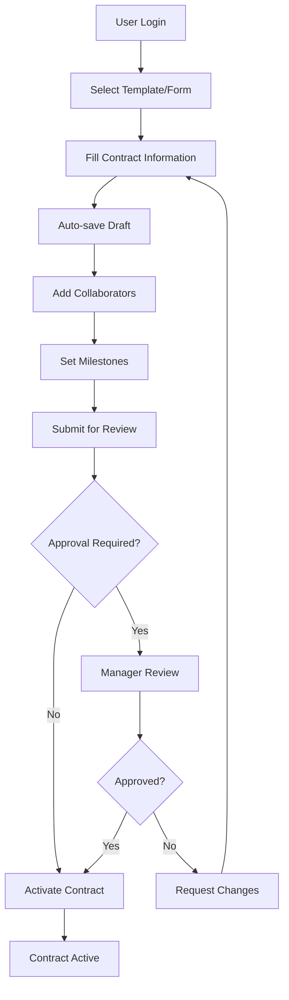
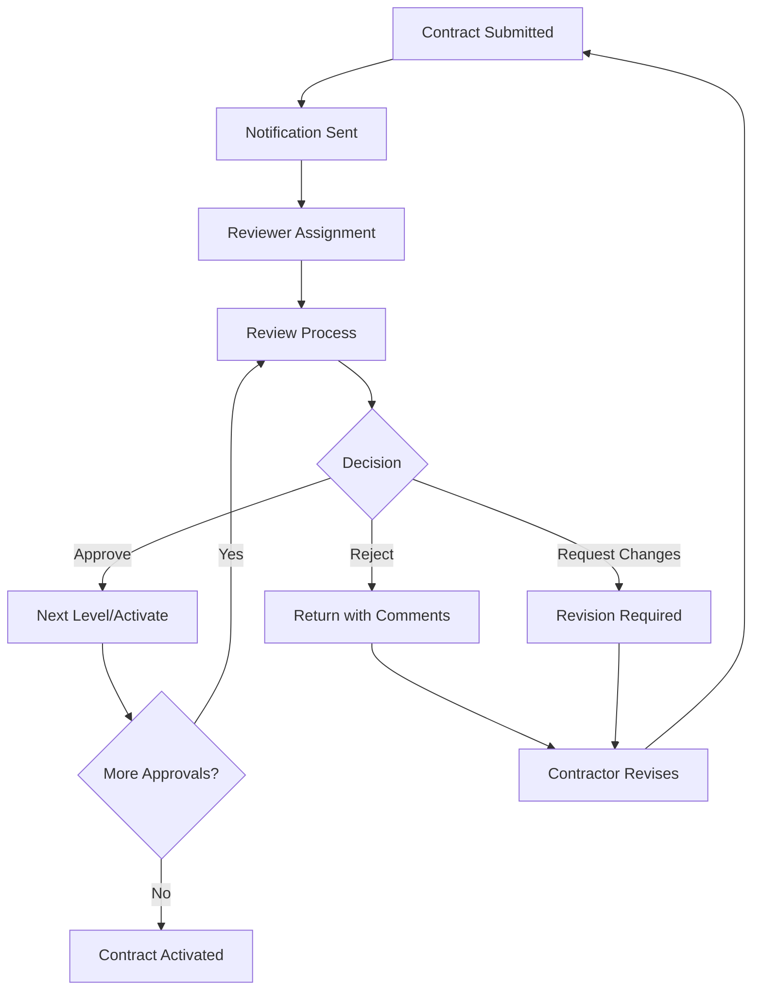
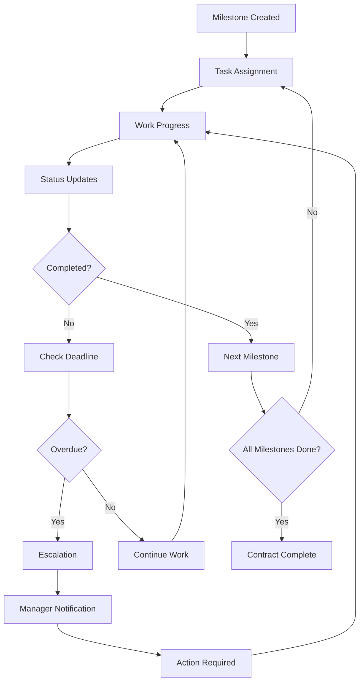
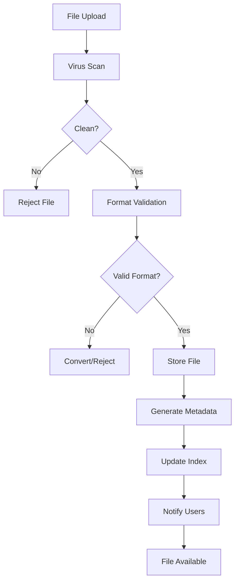

# Tổng Quan Hệ Thống Quản Lý Hợp Đồng

## 📋 Mục Lục

1. [Tổng Quan Hệ Thống](#tổng-quan-hệ-thống)
2. [Kiến Trúc Hệ Thống](#kiến-trúc-hệ-thống)
3. [Các Chức Năng Chính](#các-chức-năng-chính)
4. [Luồng Hoạt Động](#luồng-hoạt-động)
5. [Xử Lý Tình Huống](#xử-lý-tình-huống)
6. [Quy Trình Nghiệp Vụ](#quy-trình-nghiệp-vụ)
7. [Phân Quyền và Bảo Mật](#phân-quyền-và-bảo-mật)
8. [Tích Hợp và Mở Rộng](#tích-hợp-và-mở-rộng)

---

## 🏗️ Tổng Quan Hệ Thống

### Mục Tiêu
Hệ thống Quản lý Hợp đồng được thiết kế để tự động hóa và tối ưu hóa toàn bộ vòng đời hợp đồng từ tạo mới, soạn thảo, phê duyệt đến lưu trữ, đảm bảo tính minh bạch, hiệu quả và tuân thủ quy định.

### Đối Tượng Sử Dụng
- **Quản trị viên (Admin)**: Quản lý hệ thống, người dùng, cấu hình
- **Quản lý (Manager)**: Phê duyệt hợp đồng, quản lý nhân viên
- **Nhân viên (Staff)**: Tạo và quản lý hợp đồng
- **Cộng tác viên (Collaborator)**: Tham gia vào quá trình soạn thảo và phê duyệt

### Giá Trị Mang Lại
- ⚡ **Tăng tốc độ xử lý** hợp đồng lên 70%
- 📊 **Giảm lỗi** trong quá trình soạn thảo và phê duyệt
- 🔒 **Đảm bảo tuân thủ** quy định và chính sách
- 📈 **Tăng khả năng theo dõi** và báo cáo
- 🤝 **Cải thiện hợp tác** giữa các bên liên quan

---

## 🏛️ Kiến Trúc Hệ Thống

### Backend Architecture
```
┌─────────────────┐    ┌─────────────────┐    ┌─────────────────┐
│   Frontend      │    │   API Gateway   │    │   Database      │
│   (React/Vue)   │◄──►│   (NestJS)      │◄──►│   (MySQL)       │
└─────────────────┘    └─────────────────┘    └─────────────────┘
                              │
                              ▼
                       ┌─────────────────┐
                       │   File Storage  │
                       │   (Local/Cloud) │
                       └─────────────────┘
```

### Module Structure
```
src/
├── modules/
│   ├── auth/          # Xác thực và phân quyền
│   ├── contract/      # Quản lý hợp đồng chính
│   ├── user/          # Quản lý người dùng
│   ├── notification/  # Thông báo và nhắc nhở
│   ├── uploadFile/    # Quản lý file
│   ├── admin/         # Quản trị hệ thống
│   └── cron-task/     # Tác vụ định kỳ
├── core/
│   ├── dto/           # Data Transfer Objects
│   ├── domain/        # Business entities
│   └── shared/        # Shared utilities
└── config/            # Cấu hình hệ thống
```

---

## 🎯 Các Chức Năng Chính

### 1. 🔐 Quản Lý Xác Thực và Phân Quyền

#### Chức Năng
- **Đăng nhập/Đăng xuất**: JWT-based authentication
- **Quản lý phiên làm việc**: Session management với refresh token
- **Phân quyền theo vai trò**: Role-based access control (RBAC)
- **Quản lý quyền hạn**: Granular permissions cho từng chức năng

#### Xử Lý Tình Huống
- **Token hết hạn**: Tự động refresh token
- **Đăng nhập thất bại**: Giới hạn số lần thử và khóa tài khoản
- **Quyền truy cập**: Kiểm tra và từ chối truy cập trái phép
- **Bảo mật**: Mã hóa mật khẩu, HTTPS, CORS protection

### 2. 📄 Quản Lý Hợp Đồng

#### Chức Năng
- **Tạo hợp đồng mới**: Form-based hoặc template-based
- **Chỉnh sửa hợp đồng**: Real-time editing với auto-save
- **Xem trước hợp đồng**: Preview trước khi lưu
- **Quản lý phiên bản**: Version control với rollback
- **Tìm kiếm và lọc**: Advanced search với nhiều tiêu chí

#### Xử Lý Tình Huống
- **Xung đột chỉnh sửa**: Conflict resolution khi nhiều người cùng edit
- **Mất kết nối**: Auto-save và recovery
- **Dữ liệu không hợp lệ**: Validation và error handling
- **Backup dữ liệu**: Automatic backup và restore

### 3. 🔄 Quy Trình Phê Duyệt

#### Chức Năng
- **Workflow tự động**: State machine cho quy trình phê duyệt
- **Phê duyệt nhiều cấp**: Multi-level approval process
- **Yêu cầu chỉnh sửa**: Request changes với comments
- **Từ chối hợp đồng**: Rejection với lý do
- **Theo dõi trạng thái**: Real-time status tracking

#### Xử Lý Tình Huống
- **Người phê duyệt vắng mặt**: Auto-escalation hoặc ủy quyền
- **Deadline quá hạn**: Automatic reminders và escalation
- **Phê duyệt đồng thời**: Parallel approval handling
- **Rollback quyết định**: Ability to reverse approval decisions

### 4. 👥 Quản Lý Cộng Tác

#### Chức Năng
- **Thêm cộng tác viên**: Invite collaborators với roles
- **Phân quyền chi tiết**: Granular permissions (read, write, approve)
- **Chuyển quyền sở hữu**: Transfer ownership
- **Quản lý nhóm**: Team-based collaboration
- **Activity tracking**: Theo dõi hoạt động của từng người

#### Xử Lý Tình Huống
- **Xung đột quyền**: Permission conflict resolution
- **Người dùng rời đi**: Ownership transfer và data protection
- **Quyền truy cập thay đổi**: Dynamic permission updates
- **Audit trail**: Complete activity logging

### 5. 📋 Quản Lý Milestone và Task

#### Chức Năng
- **Tạo milestone**: Define key project milestones
- **Quản lý task**: Task assignment và tracking
- **Deadline management**: Due date tracking và reminders
- **Progress tracking**: Completion status monitoring
- **Dependency management**: Task dependencies và critical path

#### Xử Lý Tình Huống
- **Task quá hạn**: Automatic escalation và notification
- **Resource conflicts**: Resource allocation optimization
- **Scope changes**: Impact analysis và adjustment
- **Risk management**: Risk identification và mitigation

### 6. 📁 Quản Lý Tài Liệu

#### Chức Năng
- **Upload files**: Multiple file types support
- **Version control**: File versioning và history
- **Metadata management**: File categorization và tagging
- **Search và filter**: Advanced file search
- **Access control**: File-level permissions

#### Xử Lý Tình Huống
- **File corruption**: Integrity checking và recovery
- **Storage limits**: Automatic cleanup và archiving
- **Format compatibility**: File format validation
- **Virus scanning**: Security scanning cho uploaded files

### 7. 📊 Analytics và Báo Cáo

#### Chức Năng
- **Dashboard**: Real-time metrics và KPIs
- **Contract analytics**: Performance analysis
- **Audit logs**: Complete activity tracking
- **Custom reports**: Flexible reporting system
- **Export capabilities**: PDF, Excel, CSV export

#### Xử Lý Tình Huống
- **Data accuracy**: Real-time data synchronization
- **Performance optimization**: Caching và indexing
- **Large datasets**: Pagination và lazy loading
- **Report generation**: Background processing cho large reports

### 8. 🔔 Thông Báo và Nhắc Nhở

#### Chức Năng
- **Real-time notifications**: Instant alerts
- **Scheduled reminders**: Automated reminders
- **Email notifications**: Email integration
- **Push notifications**: Mobile push support
- **Notification preferences**: Customizable settings

#### Xử Lý Tình Huống
- **Delivery failures**: Retry mechanism và fallback
- **Notification overload**: Smart filtering và batching
- **User preferences**: Respect user notification settings
- **Escalation**: Automatic escalation cho urgent matters

---

## 🔄 Luồng Hoạt Động

### 1. Luồng Tạo Hợp Đồng Mới



#### Xử Lý Tình Huống
- **Template không phù hợp**: Cho phép chỉnh sửa template hoặc tạo mới
- **Thiếu thông tin**: Validation và guided completion
- **Phê duyệt bị từ chối**: Feedback loop và revision process
- **Deadline quá hạn**: Automatic escalation

### 2. Luồng Phê Duyệt Hợp Đồng



#### Xử Lý Tình Huống
- **Reviewer unavailable**: Auto-escalation hoặc reassignment
- **Conflicting feedback**: Mediation process
- **Urgent approval**: Expedited approval process
- **Compliance issues**: Legal review integration

### 3. Luồng Quản Lý Milestone



#### Xử Lý Tình Huống
- **Resource constraints**: Resource reallocation
- **Scope changes**: Impact assessment và adjustment
- **Quality issues**: Quality gates và review process
- **External dependencies**: External dependency management

### 4. Luồng Quản Lý File



#### Xử Lý Tình Huống
- **File too large**: Compression hoặc chunked upload
- **Unsupported format**: Format conversion service
- **Storage full**: Automatic archiving
- **Access denied**: Permission checking và error handling

---

## ⚠️ Xử Lý Tình Huống

### 1. Tình Huống Khẩn Cấp

#### Hệ Thống Sập
- **Automatic failover**: Backup server activation
- **Data recovery**: Point-in-time recovery
- **Service degradation**: Graceful degradation
- **Communication**: User notification system

#### Mất Dữ Liệu
- **Backup restoration**: Multiple backup strategies
- **Data validation**: Integrity checking
- **User notification**: Transparent communication
- **Recovery procedures**: Step-by-step recovery

### 2. Tình Huống Nghiệp Vụ

#### Hợp Đồng Quá Hạn
- **Automatic detection**: Deadline monitoring
- **Escalation process**: Manager notification
- **Extension handling**: Approval for extensions
- **Penalty calculation**: Automatic penalty assessment

#### Xung Đột Quyền
- **Permission matrix**: Clear permission hierarchy
- **Conflict resolution**: Mediation process
- **Audit trail**: Complete activity logging
- **Override procedures**: Emergency override capabilities

#### Compliance Violations
- **Compliance checking**: Automated compliance validation
- **Legal review**: Integration with legal systems
- **Risk assessment**: Risk scoring và mitigation
- **Regulatory updates**: Automatic compliance updates

### 3. Tình Huống Kỹ Thuật

#### Performance Issues
- **Load balancing**: Automatic load distribution
- **Caching strategy**: Multi-level caching
- **Database optimization**: Query optimization
- **Resource scaling**: Auto-scaling capabilities

#### Security Threats
- **Intrusion detection**: Real-time threat monitoring
- **Access control**: Multi-factor authentication
- **Data encryption**: End-to-end encryption
- **Audit logging**: Comprehensive security logging

---

## 📋 Quy Trình Nghiệp Vụ

### 1. Quy Trình Tạo Hợp Đồng

#### Bước 1: Chuẩn Bị
- Xác định loại hợp đồng và template phù hợp
- Thu thập thông tin cần thiết
- Xác định các bên liên quan

#### Bước 2: Soạn Thảo
- Điền thông tin cơ bản
- Chỉnh sửa nội dung theo yêu cầu
- Thêm điều khoản và điều kiện

#### Bước 3: Review Nội Bộ
- Kiểm tra tính chính xác
- Đảm bảo tuân thủ quy định
- Phê duyệt nội bộ

#### Bước 4: Phê Duyệt Chính Thức
- Gửi phê duyệt theo quy trình
- Xử lý feedback và chỉnh sửa
- Ký kết và kích hoạt

### 2. Quy Trình Phê Duyệt

#### Cấp 1: Review Kỹ Thuật
- Kiểm tra tính hợp lệ
- Đánh giá rủi ro kỹ thuật
- Đề xuất cải thiện

#### Cấp 2: Review Pháp Lý
- Kiểm tra tuân thủ pháp luật
- Đánh giá rủi ro pháp lý
- Phê duyệt điều khoản

#### Cấp 3: Phê Duyệt Cuối
- Đánh giá tổng thể
- Quyết định cuối cùng
- Ký kết hợp đồng

### 3. Quy Trình Quản Lý Thay Đổi

#### Yêu Cầu Thay Đổi
- Đăng ký yêu cầu thay đổi
- Đánh giá tác động
- Phê duyệt thay đổi

#### Thực Hiện Thay Đổi
- Tạo version mới
- Thông báo các bên liên quan
- Cập nhật tài liệu

#### Kiểm Soát Thay Đổi
- Theo dõi thực hiện
- Đánh giá kết quả
- Đóng yêu cầu thay đổi

---

## 🔐 Phân Quyền và Bảo Mật

### 1. Hệ Thống Phân Quyền

#### Super Admin
- Quản lý toàn bộ hệ thống
- Cấu hình và bảo trì
- Quản lý người dùng cao cấp

#### Admin
- Quản lý người dùng và nhóm
- Cấu hình workflow
- Báo cáo hệ thống

#### Manager
- Phê duyệt hợp đồng
- Quản lý nhân viên
- Báo cáo quản lý

#### Staff
- Tạo và quản lý hợp đồng
- Tham gia quy trình phê duyệt
- Xem báo cáo cá nhân

### 2. Bảo Mật Dữ Liệu

#### Mã Hóa
- Dữ liệu truyền tải: TLS/SSL
- Dữ liệu lưu trữ: AES-256
- Mật khẩu: bcrypt hashing

#### Kiểm Soát Truy Cập
- Role-based access control
- Attribute-based access control
- Session management

#### Audit và Monitoring
- Real-time monitoring
- Comprehensive logging
- Security alerts

---

## 🔗 Tích Hợp và Mở Rộng

### 1. Tích Hợp Hệ Thống

#### ERP Integration
- SAP, Oracle, Microsoft Dynamics
- Data synchronization
- Workflow integration

#### Email Systems
- Microsoft Exchange, Gmail
- Calendar integration
- Notification delivery

#### Document Management
- SharePoint, Google Drive
- File synchronization
- Version control

### 2. API và Webhooks

#### RESTful API
- CRUD operations
- Batch processing
- Real-time updates

#### Webhook Integration
- Event-driven notifications
- Third-party integrations
- Custom workflows

### 3. Mobile Support

#### Mobile App
- iOS và Android support
- Offline capabilities
- Push notifications

#### Responsive Web
- Mobile-optimized interface
- Touch-friendly design
- Progressive web app

---

## 📈 KPI và Metrics

### 1. Performance Metrics

#### Thời Gian Xử Lý
- Thời gian tạo hợp đồng: < 30 phút
- Thời gian phê duyệt: < 48 giờ
- Thời gian ký kết: < 7 ngày

#### Chất Lượng
- Tỷ lệ lỗi: < 1%
- Tỷ lệ tuân thủ: > 99%
- Độ chính xác: > 99.9%

### 2. Business Metrics

#### Hiệu Quả
- Giảm thời gian xử lý: 70%
- Tăng năng suất: 50%
- Giảm chi phí: 30%

#### Tuân Thủ
- Audit compliance: 100%
- Regulatory compliance: 100%
- Risk mitigation: 95%

---

## 🚀 Roadmap Phát Triển

### Phase 1: Core Features (Hoàn thành)
- ✅ Quản lý hợp đồng cơ bản
- ✅ Quy trình phê duyệt
- ✅ Quản lý người dùng
- ✅ Báo cáo cơ bản

### Phase 2: Advanced Features (Đang phát triển)
- 🔄 AI-powered contract analysis
- 🔄 Advanced workflow automation
- 🔄 Mobile application
- 🔄 Advanced analytics

### Phase 3: Enterprise Features (Kế hoạch)
- 📋 Multi-tenant architecture
- 📋 Advanced security features
- 📋 Blockchain integration
- 📋 Machine learning insights

---

## 📞 Hỗ Trợ và Liên Hệ

### Technical Support
- **Email**: support@contractmanagement.com
- **Phone**: +84 123 456 789
- **Documentation**: https://docs.contractmanagement.com

### Business Support
- **Account Manager**: account@contractmanagement.com
- **Sales**: sales@contractmanagement.com
- **Training**: training@contractmanagement.com

---

*Tài liệu này được cập nhật lần cuối: Tháng 1, 2024*